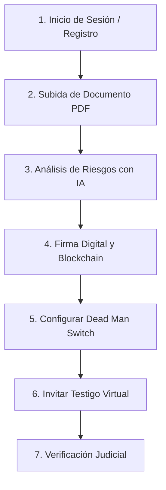

# 🛡️ Guía de Presentación y Manual de Usuario — TrustBridge

¡Bienvenido a la guía oficial de presentación de **TrustBridge**! Este documento está diseñado para que puedas realizar una demostración en vivo impecable y profesional de todas las capacidades tecnológicas de tu plataforma ante cualquier jurado, cliente o inversor.

---

## 📋 Resumen del Flujo de la Demostración

Para mostrar el máximo valor de la aplicación, te recomendamos seguir este orden cronológico durante tu presentación:

---

## 🛠️ Paso 0: Preparación antes de la Demo

1. **Servidor Activo:** Asegúrate de tener el servidor de desarrollo corriendo (`python manage.py runserver`).
2. **Acceso Internet:** Necesario para el envío de correos por Gmail SMTP.
3. **Credenciales de Prueba:**
   * **Usuario Administrador:** `msb.duck@gmail.com`
   * **Cuenta de Testigo:** `msb.tesla@gmail.com` (o cualquier otro correo secundario para recibir la invitación de testigo).

---

## 🚪 Paso 1: Registro e Inicio de Sesión (Estilo Bootstrap 5)

### Qué mostrar:
* La interfaz limpia y adaptada a móviles.
* El flujo seguro que combina correo/contraseña y el bypass inteligente de doble factor (2FA) configurado para facilitar el desarrollo ágil local.

### Guión para la presentación:
> *"Comenzamos en la pantalla de inicio de sesión de TrustBridge. La plataforma cuenta con un sistema de autenticación robusto basado en Django y Allauth, completamente integrado con estilos Bootstrap 5 y preparado para incorporar autenticación de dos factores (2FA) mediante códigos TOTP para máxima seguridad."*

---

## 📂 Paso 2: Carga de Documento (Borrador)

### Qué hacer en la demo:
1. Ve al **Dashboard** principal.
2. Haz clic en **"Subir Documento"**.
3. Selecciona cualquier archivo PDF de prueba de tu ordenador.
4. Asígnale un título descriptivo (ej. *Contrato de Colaboración*) y haz clic en **Subir**.
5. Verás el documento listado en estado **Borrador**.

---

## 🤖 Paso 3: Análisis de Cláusulas con Inteligencia Artificial

### Qué hacer en la demo:
1. Entra al detalle del documento que acabas de subir.
2. Haz clic en el botón azul **"Analizar con IA"**.
3. El sistema extraerá el texto del PDF y generará un diagnóstico de riesgos legal inmediato.

### Qué destacar:
* **Puntuación de Riesgo (Risk Score):** Evaluación del 0 al 100 del peligro del contrato.
* **Cláusulas Identificadas:** Identificación y categorización de riesgos (Alto, Medio, Bajo). Muestra cláusulas de penalización por terminación anticipada o renovación automática.
* **Recomendación Legal:** Consejo directo proporcionado por la IA.

> *"Para evitar la lectura tediosa de contratos extensos, TrustBridge incorpora un motor de IA que analiza el contenido del PDF al instante, clasificando los riesgos jurídicos en semáforos de color (rojo para riesgo alto, amarillo para medio) y aconsejando al usuario antes de proceder a la firma."*

---

## ✍️ Paso 4: Firma Digital y Sellado en Blockchain

### Qué hacer en la demo:
1. En la ficha del documento, haz clic en **"Firmar documento"**.
2. Completa los datos requeridos (el sistema solicitará permisos de ubicación GPS).
3. Haz clic en **"Firmar"**.
4. El documento cambiará instantáneamente a estado **Firmado** y se abrirá una tarjeta verde con la **evidencia criptográfica**.

### Evidencias Legales a destacar:
* **Huella Digital (SHA-256):** El identificador matemático único del archivo original.
* **Blockchain TX:** El hash de la transacción que demuestra que la firma ha quedado sellada de forma inalterable en la cadena de bloques.
* **GPS Verificado:** Ubicación satelital exacta del firmante en el momento de la firma.
* **Biometría de Prueba de Vida (Liveness):** Confirmación visual del firmante.

---

## ⏰ Paso 5: Dead Man Switch (Garantía de Custodia)

### Qué hacer en la demo:
1. Haz clic en el botón naranja **"Activar Dead Man Switch"**.
2. Configura los parámetros de prueba:
   * **Intervalo de check-in:** `30` días.
   * **Periodo de gracia:** `7` días.
   * **Acción al vencer:** *Notificarme por correo*.
3. Haz clic en guardar. Verás el estado en **"Monitorizando"**.

### Cómo explicarlo:
> *"El 'Dead Man Switch' o 'Disparador de Inactividad' es una característica clave para testamentos digitales o acuerdos confidenciales. Si el propietario del documento deja de dar señales de vida durante el intervalo configurado, el sistema ejecuta de forma totalmente autónoma la acción programada (enviar correos de alerta, liberar el contrato a sus herederos, etc.)."*

---

## 📹 Paso 6: Invitación a Testigo Virtual

### Qué hacer en la demo:
1. Haz clic en el botón azul **"Invitar testigo"**.
2. Escribe el correo del testigo (ej. `msb.tesla@gmail.com`).
3. Haz clic en **"Crear sesión de testigo"**.
4. **¡Prueba del correo en vivo!** Abre la bandeja de entrada del correo del testigo para mostrar que el correo real de invitación de Gmail ha llegado de inmediato con el enlace de la sala virtual.

---

## ⚖️ Paso 7: Panel de Verificación Judicial (Auditoría Externa)

### Qué hacer en la demo:
1. Copia el **Hash SHA-256** o el **ID** de tu documento firmado.
2. Haz clic en **"Verificación judicial"** en la barra de navegación superior.
3. Pega el código en el buscador y haz clic en **"Verificar"**.
4. Se mostrará el **Informe Pericial de Autenticidad** listo para ser presentado en un tribunal, incluyendo la opción de **"Imprimir reporte de verificación"**.

> *"Cualquier perito judicial o auditor externo puede entrar a TrustBridge sin necesidad de registrarse y subir el hash del documento para verificar en tiempo real que las firmas, marcas de tiempo, datos GPS y registros Blockchain son 100% auténticos e inalterados."*

---

¡Mucho éxito en tu presentación! Tu aplicación TrustBridge está lista para sorprender. 🚀
